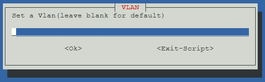
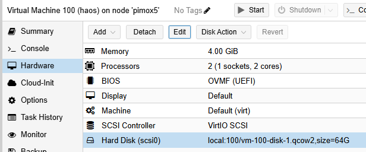
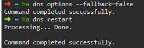

# Installation de Home Assistant sur Pimox

## Installer Home Assistant

1. Dans la console Shell de Proxmox, exécutez la commande :

    ```sh
    bash -c "$(wget -qLO - https://github.com/community-scripts/ProxmoxVE/raw/main/vm/pimox-haos-vm.sh)"
    ```

    

1. Cliquez `Yes`.
   
1. Sélectionnez `Advanced`.
   
1. CHoisissez la dernière version disponible.
   
1. Laissez l'ID proposé pour la machine virtuelle. Ici `100`.
   
1. Modifiez le nom de la machine. Par exemple `haos`.
    
1. Conservez le nombre de CPU proposé. Ici `2`.
   
1. Consevez la quantité de RAM proposée. Ici `4096`.
    
1. Conservez le nom du pont proposé. Ici `vmbr0`.
   
1. Modifiez si besoin l'adresse MAC, si vous avez déjà réservé une adresse IP pour cette machine.

1. Modifiez le Vlan si vous en utilisez un.
    
1. Conservez la taille du MTU proposé.
    
1. Démarrez l'installation en cliquant `Yes`.
    
1. Confirmez la création de la machine virtuelle en cliquant `Yes`.
    

1. L'installation se termine avec les messages suivants :

    ```sh
    Using Advanced Settings
    Using HAOS Version: 14.0
    Virtual Machine ID: 100
    Using Hostname: haos
    Allocated Cores: 2
    Allocated RAM: 4096
    Using Bridge: vmbr0
    Using MAC Address: 00:10:1F:1F:1F:1F
    Using Vlan: Default
    Using Interface MTU Size: Default
    Start VM when completed: yes
    Creating a HAOS VM using the above advanced settings
    ✓ Using local for Storage Location.
    ✓ Virtual Machine ID is 100.
    ✓ https://github.com/home-assistant/operating-system/releases/download/14.0/haos_generic-aarch64-14.0.qcow2.xz
    ✓ Downloaded haos_generic-aarch64-14.0.qcow2.xz
    ✓ Extracted Disk Image
    ✓ Created HAOS VM (haos)
    ✓ Started Home Assistant OS VM
    ✓ Completed Successfully!
    ```

1. Allez dans la console de la machine virtuelle.

    

1. Récupérez l'adresse IP de la machine.

## Augmenter la taille du disque

La taille du disque de la machine virtuelle est de 6 Go par défaut, ce qui peut être insuffisant.

1. Allez dans la console de la machine virtuelle.
1. Exécutez la commande `host shutdown` pour arrêter proprement Home Assistant et la machine virtuelle.
1. Allez dans la section `Hardware` de la vm.
    
1. Sélectionnez la ligne `Hard Disk (scsi0)`.
1. Sélectionnez le menu `Disk Action` puis `Resize`.
    
1. Tapez `58` pour que la taille finale soit de `64 Go` puis cliquez `Resize disk`.
    

## Configuration du cache Disk

Le cache du disque est configuré à `None` par défaut. Il est possible de perdre des données en cas d'arrêt électrique du serveur. Il est conseillé d'utiliser le mode `Write through` qui exécute un `fsync` à chaque écriture. C'est plus lent mais c'est le mode de cache qui permet de ne pas perdre de données.

1. Allez dans la section `Hardware` de la vm.
    
1. Sélectionnez la ligne `Hard Disk (scsi0)`.
1. Sélectionnez le menu `Edit`
    
1. Sélectionnez `Write through` dans le menu déroulant puis `OK`.
    
1. Cliquez `Start` pour démarrer la vm.
    

## Configuration de l'adresse IP

1. Connectez vous sur Home Assistant.
1. Allez dans `Paramètres -> Système -> Réseau`.
1. Sélectionnez `IPv4` sous `Configurer les interfaces réseau` puis choisissez `Statique`.
1. Cliquez `Enregistrer`.

## Contournement les requêtes DNS over HTTPS bloquées

1. Connectez vous sur Home Assistant.
1. Installez et configurez le module complémentaire `Advanced SSH & Web Terminal`.
1. Changez `username` et `password` dans la section `Configuration` du module.
    
1. Cliquez `Enregistrer` puis redémarrez le module.
1. Exécutez dans `Terminal`.

    ```sh
    ha dns options --fallback=false
    ha dns restart
    ```

    

## Références

- [Installing Home Assistant OS using Proxmox 8](https://community.home-assistant.io/t/installing-home-assistant-os-using-proxmox-8/201835)
- [Home Assistant: Proxmox VE 8.3 Quick Start Guide](https://www.derekseaman.com/2023/10/home-assistant-proxmox-ve-8-0-quick-start-guide-2.html)
