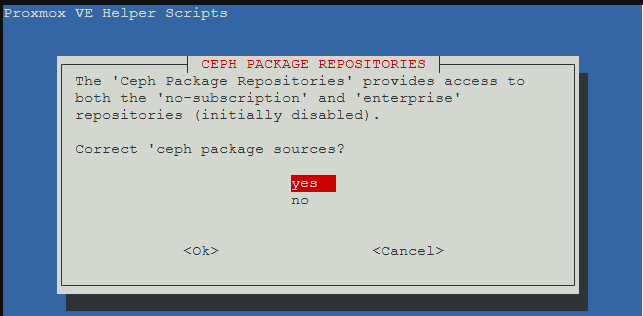

# Installer Proxmox sur Raspberry 5

Les étapes que j'ai suivi pour installer Promox sur mon Raspberry 5 en décembre 2024.

## Installer RPi OS Lite 64-bit

Install "RPi OS Lite 64-bit" with [Raspberry Pi Imager](https://www.raspberrypi.com/software/). It's listed under "Raspberry Pi OS (Other)"


I set my user and password already here in the Raspberry Pi Imager when asked for config, so it's easy to SSH in later. I suggest you do the same.

## Configurer le réseau avec une IP fixe

1. Assignez à votre Rapberry une adresse IP statique dans votre routeur
2. Connectez-vous en SSH sur le Pi

### Méthode 1

1. Exécutez `nmtui` pour lancer l'interface graphique de configuration réseau avec `nmtui`
1. Ajustez l'adresse IP statique.

### Méthode 2

1. Basculez votre session en tant que root

    ```sh
    sudo -s
    ```

1. Editez le fichier dhcpcd.conf

    ```sh
    nano /etc/dhcpcd.conf
    ```

1. Collez-y les lignes suivantes

    ```sh
    interface eth0
    static_routers=192.168.1.1
    static domain_name_servers=192.168.1.1
    static ip_address=192.168.1.xx/24
    ```

> [!IMPORTANT]
> Remplacez `192.168.0.xx` avec l'adresse IP statique.

1. Adaptez le contenu à votre configuration réseau

1. Vous pouvez exécuter les commandes suivantes pour insérer les lignes dans le fichier :

    ```sh
    touch /etc/dhcpcd.conf
    sed -i '/^interface eth0$/d' /etc/dhcpcd.conf
    sed -i '/^static_routers=192.168.1.1$/d' /etc/dhcpcd.conf
    sed -i '/^static domain_name_servers=192.168.1.1$/d' /etc/dhcpcd.conf
    sed -i '/^static ip_address=192.168.1.xx\/24$/d' /etc/dhcpcd.conf
    ```

## Installer les mises à jour

```sh
apt-get update
apt-get upgrade -y
```

## Configurer le fichier hosts

1. Editez le fichier hosts :

    ```sh
    nano /etc/hosts
    ```

1. Adaptez son contenu pour qu'il ait cette forme :

```sh
127.0.0.1       localhost pimox5
192.168.1.xx    pimox5
::1             localhost ip6-localhost ip6-loopback
ff02::1         ip6-allnodes
ff02::2         ip6-allrouters

127.0.1.1       pimox5
```

> [!IMPORTANT]
> Remplacez `192.168.0.xx` avec l'adresse IP statique.

## Editer le fichier hostname

```sh
nano /etc/hostname
```

```sh
pimox5
```

## Modifier le mot de passe de root

Ce mot de passe vous sera utile pour vous connecter sous l'interface de Promox.

```sh
passwd root
```

## Redémarrer

```sh
reboot
```

## Ajouter les sources de Proxmox Port et les clés

Basculez en tant que root et assurez vous que `curl` est installé :

```sh
sudo -s
apt install curl
```

Déclarez les sources et la clé :

```sh
echo "deb [arch=arm64] https://mirrors.apqa.cn/proxmox/debian/pve bookworm port">/etc/apt/sources.list.d/pveport.list
curl https://mirrors.apqa.cn/proxmox/debian/pveport.gpg -o /etc/apt/trusted.gpg.d/pveport.gpg
```

## Mettre à jour les sources et installer Proxmox

1. Basculez en tant que root :

    ```sh
    sudo -s
    ```

1. Mettez à jour les sources :

    ```sh
    apt-get update
    ```

    La commande affiche :

    ```sh
    Hit:1 http://deb.debian.org/debian bookworm InRelease
    Hit:2 http://deb.debian.org/debian-security bookworm-security InRelease
    Hit:3 http://deb.debian.org/debian bookworm-updates InRelease
    Hit:4 http://archive.raspberrypi.com/debian bookworm InRelease
    Get:5 https://mirrors.apqa.cn/proxmox/debian/pve bookworm InRelease [5,725 B]
    Get:6 https://mirrors.apqa.cn/proxmox/debian/pve bookworm/port arm64 Packages [898 kB]
    Fetched 904 kB in 1s (1,344 kB/s)
    Reading package lists... Done
    ```

1. Appliquez les mises à jour :

    ```sh
    apt-get upgrade -y
    ```

    La commande affiche :

    ```sh
    Reading package lists... Done
    Building dependency tree... Done
    Reading state information... Done
    Calculating upgrade... Done
    The following package was automatically installed and is no longer required:
    libboost-iostreams1.74.0
    Use 'apt autoremove' to remove it.
    The following packages have been kept back:
    labwc linux-headers-rpi-2712 linux-headers-rpi-v8 linux-image-rpi-2712 linux-image-rpi-v8 raspberrypi-ui-mods
    The following packages will be upgraded:
    libpixman-1-0 librados2 librbd1
    3 upgraded, 0 newly installed, 0 to remove and 6 not upgraded.
    Need to get 5,927 kB of archives.
    After this operation, 5,718 kB of additional disk space will be used.
    Get:1 https://mirrors.apqa.cn/proxmox/debian/pve bookworm/port arm64 libpixman-1-0 arm64 0.44.0-3 [164 kB]
    Get:2 https://mirrors.apqa.cn/proxmox/debian/pve bookworm/port arm64 librbd1 arm64 17.2.7-pve3 [2,734 kB]
    Get:3 https://mirrors.apqa.cn/proxmox/debian/pve bookworm/port arm64 librados2 arm64 17.2.7-pve3 [3,029 kB]
    Fetched 5,927 kB in 0s (14.8 MB/s)
    apt-listchanges: Reading changelogs...
    (Reading database ... 128601 files and directories currently installed.)
    Preparing to unpack .../libpixman-1-0_0.44.0-3_arm64.deb ...
    Unpacking libpixman-1-0:arm64 (0.44.0-3) over (0.42.2-1+rpt3) ...
    Preparing to unpack .../librbd1_17.2.7-pve3_arm64.deb ...
    Unpacking librbd1 (17.2.7-pve3) over (16.2.15+ds-0+deb12u1) ...
    Preparing to unpack .../librados2_17.2.7-pve3_arm64.deb ...
    Unpacking librados2 (17.2.7-pve3) over (16.2.15+ds-0+deb12u1) ...
    Setting up libpixman-1-0:arm64 (0.44.0-3) ...
    Setting up librados2 (17.2.7-pve3) ...
    Setting up librbd1 (17.2.7-pve3) ...
    Processing triggers for libc-bin (2.36-9+rpt2+deb12u9) ...
    ```

1. Appliquez les mises à jour :

    ```sh
    apt-get full-upgrade -y
    ```

    La commande affiche :

    ```sh
    Reading package lists... Done
    Building dependency tree... Done
    Reading state information... Done
    Calculating upgrade... Done
    The following packages were automatically installed and are no longer required:
    libboost-iostreams1.74.0 libwlroots12
    Use 'apt autoremove' to remove them.
    The following packages will be REMOVED:
    lxinput
    The following NEW packages will be installed:
    libwlroots-0.18 libxcb-errors0 linux-headers-6.6.62+rpt-common-rpi linux-headers-6.6.62+rpt-rpi-2712
    linux-headers-6.6.62+rpt-rpi-v8 linux-image-6.6.62+rpt-rpi-2712 linux-image-6.6.62+rpt-rpi-v8 linux-kbuild-6.6.62+rpt rasputin
    The following packages will be upgraded:
    labwc linux-headers-rpi-2712 linux-headers-rpi-v8 linux-image-rpi-2712 linux-image-rpi-v8 raspberrypi-ui-mods
    6 upgraded, 9 newly installed, 1 to remove and 0 not upgraded.
    Need to get 72.7 MB of archives.
    After this operation, 124 MB of additional disk space will be used.
    Get:1 http://archive.raspberrypi.com/debian bookworm/main arm64 rasputin arm64 0.2 [54.4 kB]
    Get:2 http://archive.raspberrypi.com/debian bookworm/main arm64 libxcb-errors0 arm64 1.0.1-2~bpo12+1+rpt1 [19.9 kB]
    Get:3 http://archive.raspberrypi.com/debian bookworm/main arm64 libwlroots-0.18 arm64 0.18.1-1+rpt6 [453 kB]
    Get:4 http://archive.raspberrypi.com/debian bookworm/main arm64 labwc arm64 0.8.1-1+rpt1 [247 kB]
    Get:5 http://archive.raspberrypi.com/debian bookworm/main arm64 linux-headers-6.6.62+rpt-common-rpi all 1:6.6.62-1+rpt1 [8,236 kB]
    Get:6 http://archive.raspberrypi.com/debian bookworm/main arm64 linux-image-6.6.62+rpt-rpi-2712 arm64 1:6.6.62-1+rpt1 [29.7 MB]
    Get:7 http://archive.raspberrypi.com/debian bookworm/main arm64 linux-kbuild-6.6.62+rpt arm64 1:6.6.62-1+rpt1 [1,013 kB]
    Get:8 http://archive.raspberrypi.com/debian bookworm/main arm64 linux-headers-6.6.62+rpt-rpi-2712 arm64 1:6.6.62-1+rpt1 [1,130 kB]
    Get:9 http://archive.raspberrypi.com/debian bookworm/main arm64 linux-image-6.6.62+rpt-rpi-v8 arm64 1:6.6.62-1+rpt1 [29.7 MB]
    Get:10 http://archive.raspberrypi.com/debian bookworm/main arm64 linux-headers-6.6.62+rpt-rpi-v8 arm64 1:6.6.62-1+rpt1 [1,130 kB]
    Get:11 http://archive.raspberrypi.com/debian bookworm/main arm64 linux-headers-rpi-2712 arm64 1:6.6.62-1+rpt1 [1,160 B]
    Get:12 http://archive.raspberrypi.com/debian bookworm/main arm64 linux-headers-rpi-v8 arm64 1:6.6.62-1+rpt1 [1,156 B]
    Get:13 http://archive.raspberrypi.com/debian bookworm/main arm64 linux-image-rpi-2712 arm64 1:6.6.62-1+rpt1 [1,420 B]
    Get:14 http://archive.raspberrypi.com/debian bookworm/main arm64 linux-image-rpi-v8 arm64 1:6.6.62-1+rpt1 [1,424 B]
    Get:15 http://archive.raspberrypi.com/debian bookworm/main arm64 raspberrypi-ui-mods arm64 1.20241211 [1,058 kB]
    Fetched 72.7 MB in 1s (69.4 MB/s)
    apt-listchanges: Reading changelogs...
    dpkg: lxinput: dependency problems, but removing anyway as you requested:
    lxde depends on rasputin | lxinput; however:
    Package rasputin is not installed.
    Package lxinput is to be removed.

    (Reading database ... 128610 files and directories currently installed.)
    Removing lxinput (0.3.5-1+rpt26) ...
    Selecting previously unselected package rasputin.
    (Reading database ... 128534 files and directories currently installed.)
    Preparing to unpack .../00-rasputin_0.2_arm64.deb ...
    Unpacking rasputin (0.2) ...
    Selecting previously unselected package libxcb-errors0:arm64.
    Preparing to unpack .../01-libxcb-errors0_1.0.1-2~bpo12+1+rpt1_arm64.deb ...
    Unpacking libxcb-errors0:arm64 (1.0.1-2~bpo12+1+rpt1) ...
    Selecting previously unselected package libwlroots-0.18:arm64.
    Preparing to unpack .../02-libwlroots-0.18_0.18.1-1+rpt6_arm64.deb ...
    Unpacking libwlroots-0.18:arm64 (0.18.1-1+rpt6) ...
    Preparing to unpack .../03-labwc_0.8.1-1+rpt1_arm64.deb ...
    Unpacking labwc (0.8.1-1+rpt1) over (0.7.4-1+rpt1) ...
    Selecting previously unselected package linux-headers-6.6.62+rpt-common-rpi.
    Preparing to unpack .../04-linux-headers-6.6.62+rpt-common-rpi_1%3a6.6.62-1+rpt1_all.deb ...
    Unpacking linux-headers-6.6.62+rpt-common-rpi (1:6.6.62-1+rpt1) ...
    Selecting previously unselected package linux-image-6.6.62+rpt-rpi-2712.
    Preparing to unpack .../05-linux-image-6.6.62+rpt-rpi-2712_1%3a6.6.62-1+rpt1_arm64.deb ...
    Unpacking linux-image-6.6.62+rpt-rpi-2712 (1:6.6.62-1+rpt1) ...
    Selecting previously unselected package linux-kbuild-6.6.62+rpt.
    Preparing to unpack .../06-linux-kbuild-6.6.62+rpt_1%3a6.6.62-1+rpt1_arm64.deb ...
    Unpacking linux-kbuild-6.6.62+rpt (1:6.6.62-1+rpt1) ...
    Selecting previously unselected package linux-headers-6.6.62+rpt-rpi-2712.
    Preparing to unpack .../07-linux-headers-6.6.62+rpt-rpi-2712_1%3a6.6.62-1+rpt1_arm64.deb ...
    Unpacking linux-headers-6.6.62+rpt-rpi-2712 (1:6.6.62-1+rpt1) ...
    Selecting previously unselected package linux-image-6.6.62+rpt-rpi-v8.
    Preparing to unpack .../08-linux-image-6.6.62+rpt-rpi-v8_1%3a6.6.62-1+rpt1_arm64.deb ...
    Unpacking linux-image-6.6.62+rpt-rpi-v8 (1:6.6.62-1+rpt1) ...
    Selecting previously unselected package linux-headers-6.6.62+rpt-rpi-v8.
    Preparing to unpack .../09-linux-headers-6.6.62+rpt-rpi-v8_1%3a6.6.62-1+rpt1_arm64.deb ...
    Unpacking linux-headers-6.6.62+rpt-rpi-v8 (1:6.6.62-1+rpt1) ...
    Preparing to unpack .../10-linux-headers-rpi-2712_1%3a6.6.62-1+rpt1_arm64.deb ...
    Unpacking linux-headers-rpi-2712 (1:6.6.62-1+rpt1) over (1:6.6.51-1+rpt3) ...
    Preparing to unpack .../11-linux-headers-rpi-v8_1%3a6.6.62-1+rpt1_arm64.deb ...
    Unpacking linux-headers-rpi-v8 (1:6.6.62-1+rpt1) over (1:6.6.51-1+rpt3) ...
    Preparing to unpack .../12-linux-image-rpi-2712_1%3a6.6.62-1+rpt1_arm64.deb ...
    Unpacking linux-image-rpi-2712 (1:6.6.62-1+rpt1) over (1:6.6.51-1+rpt3) ...
    Preparing to unpack .../13-linux-image-rpi-v8_1%3a6.6.62-1+rpt1_arm64.deb ...
    Unpacking linux-image-rpi-v8 (1:6.6.62-1+rpt1) over (1:6.6.51-1+rpt3) ...
    Preparing to unpack .../14-raspberrypi-ui-mods_1.20241211_arm64.deb ...
    Unpacking raspberrypi-ui-mods (1.20241211) over (1.20241112) ...
    Setting up rasputin (0.2) ...
    Setting up linux-image-6.6.62+rpt-rpi-v8 (1:6.6.62-1+rpt1) ...
    /etc/kernel/postinst.d/initramfs-tools:
    update-initramfs: Generating /boot/initrd.img-6.6.62+rpt-rpi-v8
    '/boot/initrd.img-6.6.62+rpt-rpi-v8' -> '/boot/firmware/initramfs8'
    /etc/kernel/postinst.d/z50-raspi-firmware:
    '/boot/vmlinuz-6.6.62+rpt-rpi-v8' -> '/boot/firmware/kernel8.img'
    Setting up libxcb-errors0:arm64 (1.0.1-2~bpo12+1+rpt1) ...
    Setting up linux-image-6.6.62+rpt-rpi-2712 (1:6.6.62-1+rpt1) ...
    /etc/kernel/postinst.d/initramfs-tools:
    update-initramfs: Generating /boot/initrd.img-6.6.62+rpt-rpi-2712
    '/boot/initrd.img-6.6.62+rpt-rpi-2712' -> '/boot/firmware/initramfs_2712'
    /etc/kernel/postinst.d/z50-raspi-firmware:
    '/boot/vmlinuz-6.6.62+rpt-rpi-2712' -> '/boot/firmware/kernel_2712.img'
    Setting up linux-image-rpi-2712 (1:6.6.62-1+rpt1) ...
    Setting up libwlroots-0.18:arm64 (0.18.1-1+rpt6) ...
    Setting up linux-image-rpi-v8 (1:6.6.62-1+rpt1) ...
    Setting up linux-headers-6.6.62+rpt-common-rpi (1:6.6.62-1+rpt1) ...
    Setting up linux-kbuild-6.6.62+rpt (1:6.6.62-1+rpt1) ...
    Setting up labwc (0.8.1-1+rpt1) ...
    Setting up linux-headers-6.6.62+rpt-rpi-v8 (1:6.6.62-1+rpt1) ...
    Setting up linux-headers-6.6.62+rpt-rpi-2712 (1:6.6.62-1+rpt1) ...
    Setting up raspberrypi-ui-mods (1.20241211) ...
    Installing new version of config file /etc/xdg/labwc/rc.xml ...
    Setting up linux-headers-rpi-2712 (1:6.6.62-1+rpt1) ...
    Setting up linux-headers-rpi-v8 (1:6.6.62-1+rpt1) ...
    Processing triggers for hicolor-icon-theme (0.17-2) ...
    Processing triggers for gnome-menus (3.36.0-1.1) ...
    Processing triggers for libglib2.0-0:arm64 (2.74.6-2+deb12u4) ...
    Processing triggers for libc-bin (2.36-9+rpt2+deb12u9) ...
    Processing triggers for man-db (2.11.2-2) ...
    Processing triggers for shared-mime-info (2.2-1) ...
    Processing triggers for mailcap (3.70+nmu1) ...
    Processing triggers for desktop-file-utils (0.26-1) ...
    ```

1. Appliquez les mises à jour :

    ```sh
    apt-get dist-upgrade -y
    ```

    La commande affiche :

    ```sh
    Reading package lists... Done
    Building dependency tree... Done
    Reading state information... Done
    Calculating upgrade... Done
    The following packages were automatically installed and are no longer required:
    libboost-iostreams1.74.0 libwlroots12
    Use 'apt autoremove' to remove them.
    0 upgraded, 0 newly installed, 0 to remove and 0 not upgraded.
    ```

```sh
apt-get install -y ifupdown2
```

La commande affiche :

```sh
Reading package lists... Done
Building dependency tree... Done
Reading state information... Done
The following packages were automatically installed and are no longer required:
  libboost-iostreams1.74.0 libwlroots12
Use 'apt autoremove' to remove them.
The following additional packages will be installed:
  python3-systemd
Suggested packages:
  bridge-utils python3-gvgen python3-mako
The following NEW packages will be installed:
  ifupdown2 python3-systemd
0 upgraded, 2 newly installed, 0 to remove and 0 not upgraded.
Need to get 292 kB of archives.
After this operation, 2,198 kB of additional disk space will be used.
Get:1 http://deb.debian.org/debian bookworm/main arm64 python3-systemd arm64 235-1+b2 [39.1 kB]
Get:2 https://mirrors.apqa.cn/proxmox/debian/pve bookworm/port arm64 ifupdown2 all 3.2.0-1+pmx11 [253 kB]
Fetched 292 kB in 0s (1,297 kB/s)
Selecting previously unselected package python3-systemd.
(Reading database ... 148571 files and directories currently installed.)
Preparing to unpack .../python3-systemd_235-1+b2_arm64.deb ...
Unpacking python3-systemd (235-1+b2) ...
Selecting previously unselected package ifupdown2.
Preparing to unpack .../ifupdown2_3.2.0-1+pmx11_all.deb ...
Unpacking ifupdown2 (3.2.0-1+pmx11) ...
Setting up python3-systemd (235-1+b2) ...
Setting up ifupdown2 (3.2.0-1+pmx11) ...
Creating /etc/network/interfaces.
Reloading network config on first install
error: Another instance of this program is already running.
ifupdown2.postinst: Warning: Reloading failed
Created symlink /etc/systemd/system/multi-user.target.wants/networking.service → /lib/systemd/system/networking.service.
Created symlink /etc/systemd/system/network-online.target.wants/networking.service → /lib/systemd/system/networking.service.
Processing triggers for man-db (2.11.2-2) ...
```

1. Installez Promox :

```sh
apt-get install -y proxmox-ve postfix open-iscsi chrony mmc-utils usbutils
```

1. Dans Postfix Configuration, sélectionnez `Local only` puis tapez Entrée
    

1. Laissez `localhost` dans `System mail name` puis tapez Entrée
    

1. Attendez jusqu'à l'affichage de la question suivante puis tapez `N` :

    ```sh
    Configuration file '/etc/apt/sources.list.d/pveport.list'
    ==> File on system created by you or by a script.
    ==> File also in package provided by package maintainer.
    What would you like to do about it ?  Your options are:
        Y or I  : install the package maintainer's version
        N or O  : keep your currently-installed version
        D     : show the differences between the versions
        Z     : start a shell to examine the situation
    The default action is to keep your current version.
    *** pveport.list (Y/I/N/O/D/Z) [default=N] ?
    ```

1. Attendez jusqu'à l'apparition du prompt.

    ```sh
    Setting up proxmox-ve (8.3.0) ...
    Processing triggers for dbus (1.14.10-1~deb12u1) ...
    Processing triggers for mailcap (3.70+nmu1) ...
    Processing triggers for fontconfig (2.14.1-4) ...
    Processing triggers for desktop-file-utils (0.26-1) ...
    Processing triggers for initramfs-tools (0.142+rpt2+deb12u1) ...
    update-initramfs: Generating /boot/initrd.img-6.6.62+rpt-rpi-v8
    Running hook script 'zz-proxmox-boot'..
    Re-executing '/etc/kernel/postinst.d/zz-proxmox-boot' in new private mount namespace..
    No /etc/kernel/proxmox-boot-uuids found, skipping ESP sync.
    '/boot/initrd.img-6.6.62+rpt-rpi-v8' -> '/boot/firmware/initramfs8'
    update-initramfs: Generating /boot/initrd.img-6.6.62+rpt-rpi-2712
    Running hook script 'zz-proxmox-boot'..
    Re-executing '/etc/kernel/postinst.d/zz-proxmox-boot' in new private mount namespace..
    No /etc/kernel/proxmox-boot-uuids found, skipping ESP sync.
    '/boot/initrd.img-6.6.62+rpt-rpi-2712' -> '/boot/firmware/initramfs_2712'
    Processing triggers for hicolor-icon-theme (0.17-2) ...
    Processing triggers for gnome-menus (3.36.0-1.1) ...
    Processing triggers for libc-bin (2.36-9+rpt2+deb12u9) ...
    Processing triggers for man-db (2.11.2-2) ...
    Processing triggers for proxmox-backup-file-restore (3.3.0-2) ...
    Updating file-restore initramfs...
    12830 blocks
    Processing triggers for pve-ha-manager (4.0.6) ...
    ```

## Configuration du fichier interfaces

```sh
nano /etc/network/interfaces
```

Ajoutez les lignes ci-dessous à celles déjà présentes.

```sh
# interfaces(5) file used by ifup(8) and ifdown(8)
auto lo
iface lo inet loopback

iface eth0 inet manual

auto vmbr0
iface vmbr0 inet static
address 192.168.1.xx/24
gateway 192.168.1.1
bridge-ports eth0
bridge-stp off
bridge-fd 0

iface eth0 inet manual
```

> [!IMPORTANT]
> Remplacez `192.168.1.xx` avec votre adresse IP.

## Redémarrer

```sh
reboot
```

## Accéder à Pimox

1. Ouvrez l'interface Web de Proxmox avec l'adresse `http://pimox5.local:8006` or `http://192.168.1.xx:8006`

1. Connectez vous avec le username `root` et le mot de passe que vous avez défini.

1. Ne tenez pas compte de l'alerte de sécurité. Le message apparaît car vous tentez d'accéder à une adresse en https sans certificat valide.

> [!IMPORTANT]
> Remplacez `192.168.1.xx` avec votre adresse IP.

## Réaliser les actions post installation

1. Connectez vous en tant que `root` à Proxmox
1. Sélectionnez le node `pimox5` sous Datacenter puis cliquez sur `>_ Shell`

    

1. Exécutez les commandes suivantes puis répondre `y` à la question :

    ```sh
    bash -c "$(wget -qLO - https://github.com/community-scripts/ProxmoxVE/raw/main/misc/post-pve-install.sh)"
    ```

    La dernière commande affiche :

    ```sh
    This script will Perform Post Install Routines.

    Start the Proxmox VE Post Install Script (y/n)?
    ```

1. Répondre `no` à la question `Correct Promox VE sources?`
    

1. Répondre `yes` à la question `Disable 'pve-enterprise' repository`
    

1. Répondre `yes` à la question `Enable 'pve-no-subscription' repository?`
    

1. Répondre `yes` à la question `Correct 'ceph package sources?`
    

1. Répondre `no` à la question `Add (Disabled) 'pvetest' repository?`
    

1. Répondre `yes` à la question `Diable subscription nag?`
    

1. Répondre `OK`.
    

1. Répondre `yes` à la question `Disable high availability?`.
    
1. Répondre `yes`.
    
1. Répondre `yes` pour le redémarrage de Proxmox.
    

    ```sh
    ✗ Selected no to Correcting Proxmox VE Sources
    ✓ Disabled 'pve-enterprise' repository
    ✓ Enabled 'pve-no-subscription' repository
    ✓ Corrected 'ceph package repositories'
    ✗ Selected no to Adding 'pvetest' repository
    ✓ Disabled subscription nag (Delete browser cache)
    ✓ Disabled high availability
    ✓ Updated Proxmox VE
    ✓ Completed Post Install Routines
    ```

## Installer Home Assistant

Dans la console Shell de Proxmox, exécutez la commande :

```sh
bash -c "$(wget -qLO - https://github.com/community-scripts/ProxmoxVE/raw/main/vm/pimox-haos-vm.sh)"
```

Suivez les instructions et sélectionnez les options par défaut pour un Raspberry Pi 8Go.


```sh
Using Default Settings
Using HAOS Version: 14.0
Using Virtual Machine ID: 100
Using Hostname: haos14.0
Allocated Cores: 2
Allocated RAM: 4096
Using Bridge: vmbr0
Using MAC Address: 00:60:2F:6E:3E:43
Using VLAN: Default
Using Interface MTU Size: Default
Start VM when completed: yes
Creating a HAOS VM using the above default settings
 ✓ Using local for Storage Location.
 ✓ Virtual Machine ID is 100.
 ✓ https://github.com/home-assistant/operating-system/releases/download/14.0/haos_generic-aarch64-14.0.qcow2.xz
 ✓ Downloaded haos_generic-aarch64-14.0.qcow2.xz
 ✓ Extracted Disk Image
 ✓ Created HAOS VM (haos14.0)
 ✓ Started Home Assistant OS VM
 ✓ Completed Successfully!
 ```

 Allez dans la console de la machine virtuelle et récupérez l'adresse IP de la machine :

 

## Références

- [Installing Proxmox on Raspberry Pi 4 and 5](https://gist.github.com/enjikaka/52d62c9c5462748dbe35abe3c7e37f9a)
- [Comment installer Proxmox sur Raspberry Pi 5 avec Pimox](https://www.domo-blog.fr/comment-installer-proxmox-sur-raspberry-pi-5-avec-pimox/)
- [Glorious Proxmox Helper Script](https://github.com/the-polak/pimox/blob/main/pimox-post.md)
- [Proxmox VE Helper-Scripts](https://community-scripts.github.io/ProxmoxVE/)
- [Installing Home Assistant OS using Proxmox 8](https://community.home-assistant.io/t/installing-home-assistant-os-using-proxmox-8/201835)
