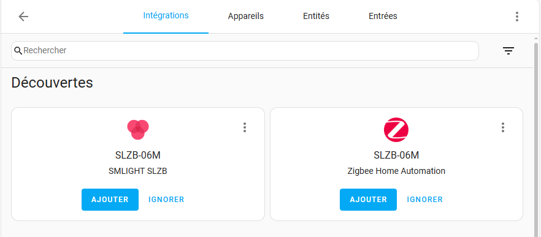
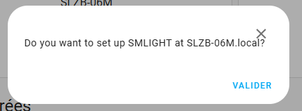
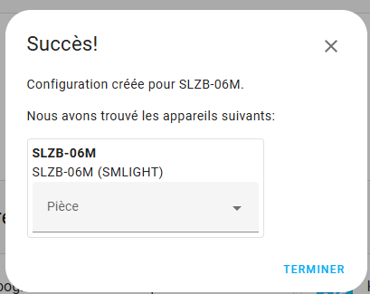

# Installation de SLZB-06M

## Installation de l'intégration dans Home Assistant

1. Connectez votre SLZB-06M sur votre réseau.
1. Home Assistant doit la détecter et vous proposer l'installation de l'intégration.
    
1. Cliquez `Ajouter` sous `SMLIGHT SLZB`.
1. Cliquez `Validez`.
    
1. Spécifiez la pièce où il se trouve puis cliquez `Terminer`.
    
